# Capture Device Events using Event Grid and Notify
`


Azure IoT Hub integrates with Azure Event Grid so that you can send event notifications to other services and trigger downstream processes. Configure your business applications to listen for IoT Hub events so that you can react to critical events in a reliable, scalable, and secure manner. For example, build an application to perform multiple actions like updating a database, creating a ticket, and delivering an email notification every time a new IoT device is registered to your IoT hub.

<iframe src="https://channel9.msdn.com/Shows/Internet-of-Things-Show/Azure-IoT-Hub-Integration-with-Azure-Event-Grid/player" width="480" height="270" allowFullScreen frameBorder="0"></iframe>

In this lab you will learn how to

* Create logic app to be able to send email notifications

* Create Event Grid

* Connect IoT Hub to Event Grid

## Create Logic App

Create a Logic App to be able to send email notifications

Click on **Create a resource**

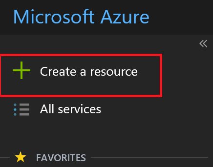

Click on **Enterprise Integration**

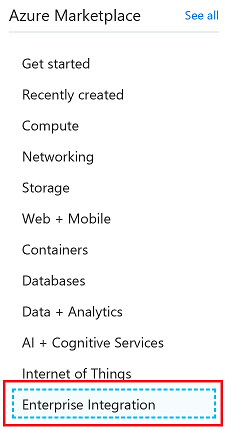

Click on **Logic Apps**

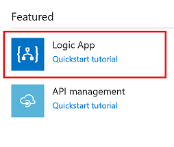

Use existing resource group created in previous steps and press Create

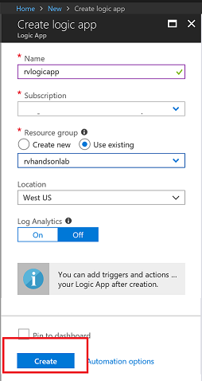

Using Logic App Designer, Create New App

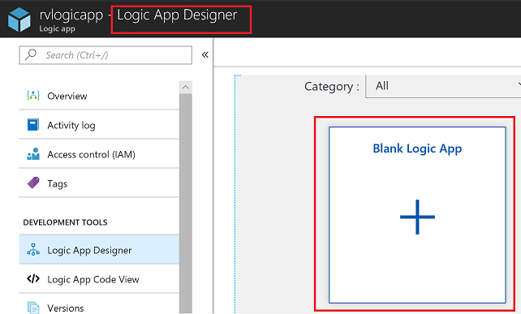

Select HTTP Request


Provide a Sample Payload

```code
[{
  "id": "56afc886-767b-d359-d59e-0da7877166b2",
  "topic": "/SUBSCRIPTIONS/<Subscription ID>/RESOURCEGROUPS/<Resource group name>/PROVIDERS/MICROSOFT.DEVICES/IOTHUBS/<IoT hub name>",
  "subject": "devices/LogicAppTestDevice",
  "eventType": "Microsoft.Devices.DeviceCreated",
  "eventTime": "2018-01-02T19:17:44.4383997Z",
  "data": {
    "twin": {
      "deviceId": "LogicAppTestDevice",
      "etag": "AAAAAAAAAAE=",
      "status": "enabled",
      "statusUpdateTime": "0001-01-01T00:00:00",
      "connectionState": "Disconnected",
      "lastActivityTime": "0001-01-01T00:00:00",
      "cloudToDeviceMessageCount": 0,
      "authenticationType": "sas",
      "x509Thumbprint": {
        "primaryThumbprint": null,
        "secondaryThumbprint": null
      },
      "version": 2,
      "properties": {
        "desired": {
          "$metadata": {
            "$lastUpdated": "2018-01-02T19:17:44.4383997Z"
          },
          "$version": 1
        },
        "reported": {
          "$metadata": {
            "$lastUpdated": "2018-01-02T19:17:44.4383997Z"
          },
          "$version": 1
        }
      }
    },
    "hubName": "egtesthub1",
    "deviceId": "LogicAppTestDevice",
    "operationTimestamp": "2018-01-02T19:17:44.4383997Z",
    "opType": "DeviceCreated"
  },
  "dataVersion": "",
  "metadataVersion": "1"
}]
```


## Setup Notification by Sending Email 

Click on New Step


Add an action

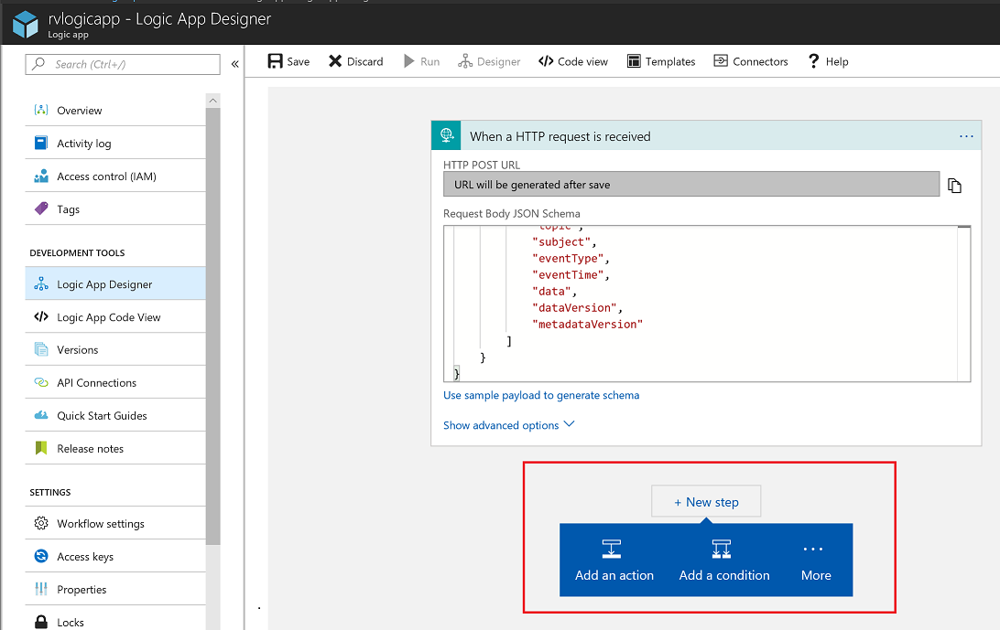

Choose Mail

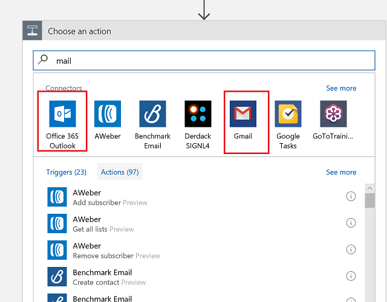

Finish Mail Actions

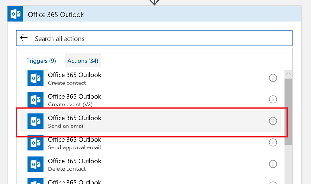

Sign in to email


Create Email template

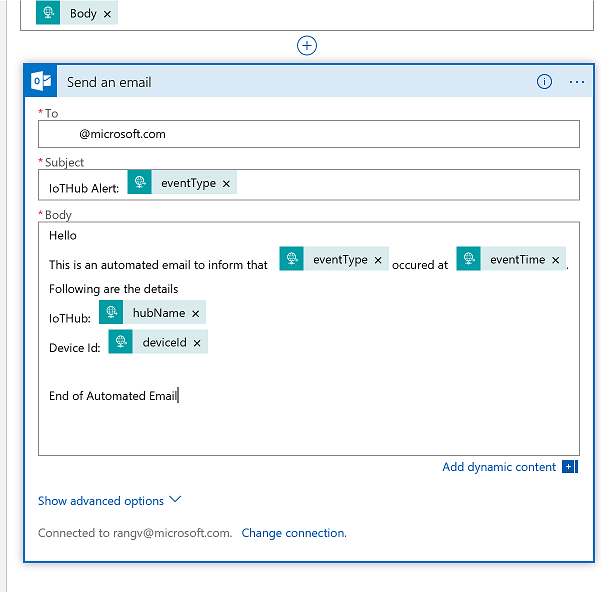

## Copy Request URL

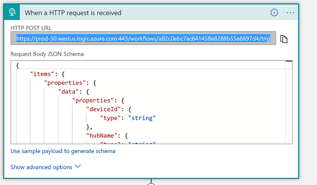

## Integrate With IoTHub

Integrate Logic App with IoTHub via Event Grid

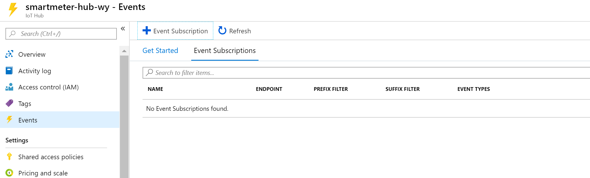

Click on Event Subscription

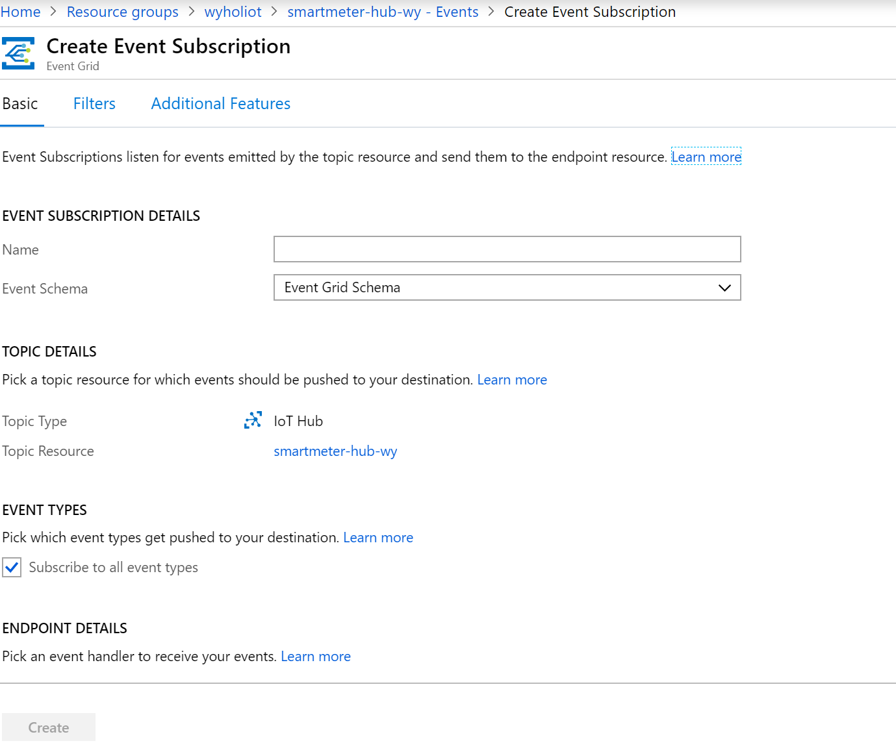

Copy the URL from previous steps into Subscriber Endpoint and click create

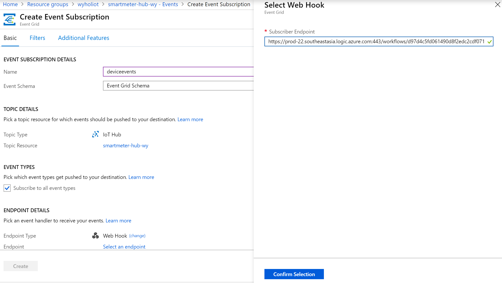

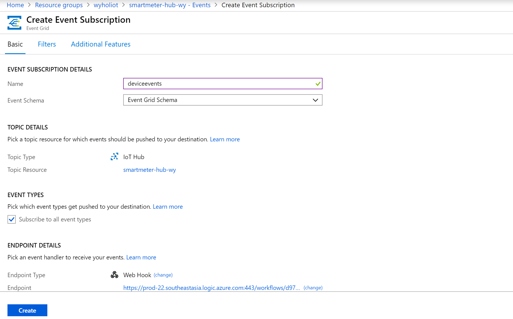

## Add Device and Test Notification

Go To IoTHub -> IoT Devices (Device Management) -> Add


Click Save button to create a new device


You Should get an email notification

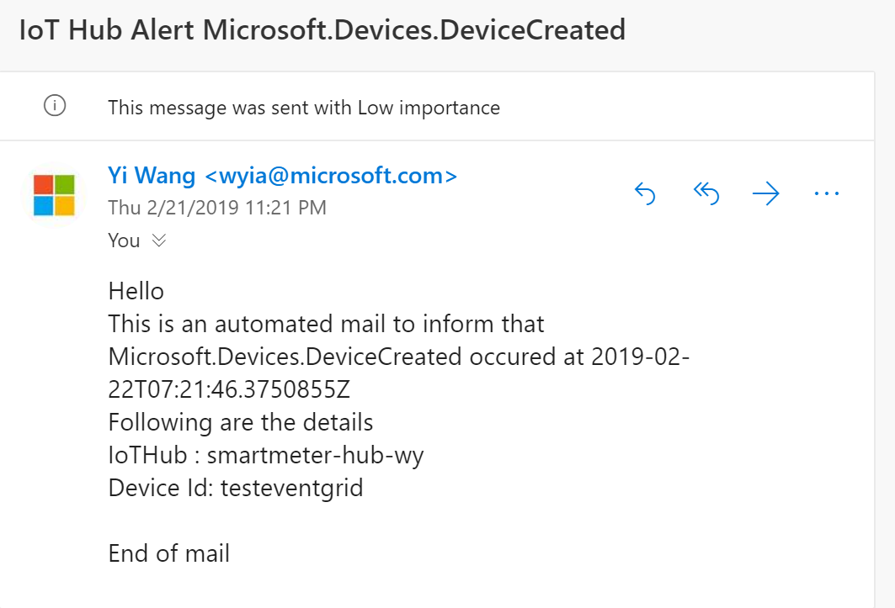

## Delete Device and Test Notification

Go To IoTHub -> IoT Devices (Device Management) -> Select Device you created in previous step -> Delete

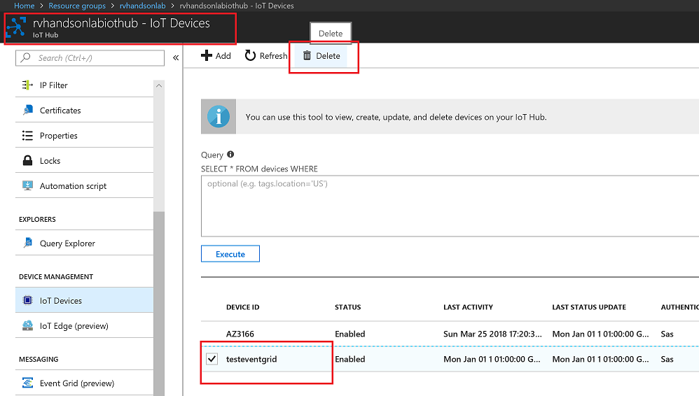

You Should get an email notification

