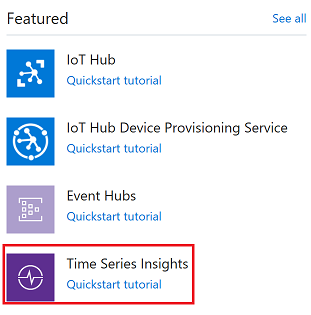
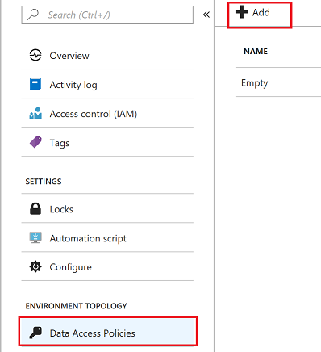
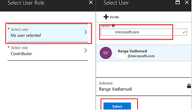
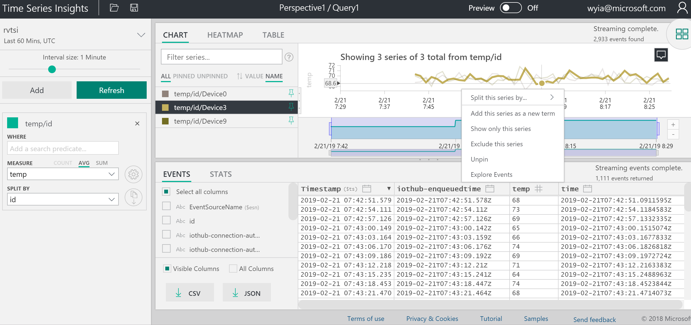

Internet of Things

Before the hands-on lab setup guide

November 2018

Information in this document, including URL and other Internet Web site references, is subject to change without notice. Unless otherwise noted, the example companies, organizations, products, domain names, e-mail addresses, logos, people, places, and events depicted herein are fictitious, and no association with any real company, organization, product, domain name, e-mail address, logo, person, place or event is intended or should be inferred. Complying with all applicable copyright laws is the responsibility of the user. Without limiting the rights under copyright, no part of this document may be reproduced, stored in or introduced into a retrieval system, or transmitted in any form or by any means (electronic, mechanical, photocopying, recording, or otherwise), or for any purpose, without the express written permission of Microsoft Corporation.

Microsoft may have patents, patent applications, trademarks, copyrights, or other intellectual property rights covering subject matter in this document. Except as expressly provided in any written license agreement from Microsoft, the furnishing of this document does not give you any license to these patents, trademarks, copyrights, or other intellectual property.

The names of manufacturers, products, or URLs are provided for informational purposes only and Microsoft makes no representations and warranties, either expressed, implied, or statutory, regarding these manufacturers or the use of the products with any Microsoft technologies. The inclusion of a manufacturer or product does not imply endorsement of Microsoft of the manufacturer or product. Links may be provided to third party sites. Such sites are not under the control of Microsoft and Microsoft is not responsible for the contents of any linked site or any link contained in a linked site, or any changes or updates to such sites. Microsoft is not responsible for webcasting or any other form of transmission received from any linked site. Microsoft is providing these links to you only as a convenience, and the inclusion of any link does not imply endorsement of Microsoft of the site or the products contained therein.

© 2018 Microsoft Corporation. All rights reserved.

Microsoft and the trademarks listed at <https://www.microsoft.com/en-us/legal/intellectualproperty/Trademarks/Usage/General.aspx> are trademarks of the Microsoft group of companies. All other trademarks are property of their respective owners.

**Contents**

<!-- TOC -->
- [Create Azure Time Series Insights and Visualize Device Data](#Create-Azure-Time-Series-Insights-and-Visualize-Device-Data)
  - [Overview](#Overview)
  - [Learning Objectives](#Learning-Objectives)
  - [Solution architecture](#Solution-architecture)
  - [Exercise](#Exercise)
       - [Create Event Source](#Create-Event-Source)
       - [Setup Time Series Insights](#Setup-Time-Series-Insights)
       - [Time Series Insights Explorer](#Time-Series-Insights-Explorer)
<!-- /TOC -->

# Create Azure Time Series Insights and Visualize Device Data

## Create Time Series Insights

Azure Time Series Insights is a fully managed analytics, storage, and visualization service for managing IoT-scale time-series data in the cloud. It provides massively scalable time-series data storage and enables you to explore and analyze billions of events streaming in from all over the world in seconds. Use Time Series Insights to store and manage terabytes of time-series data, explore and visualize billions of events simultaneously, conduct root-cause analysis, and to compare multiple sites and assets.

Time Series Insights has four key jobs:

* First, it's fully integrated with cloud gateways like Azure IoT Hub and Azure Event Hubs. It easily connects to these event sources and parses JSON from messages and structures that have data in clean rows and columns. It joins metadata with telemetry and indexes your data in a columnar store.
* Second, Time Series Insights manages the storage of your data. To ensure data is always easily accessible, it stores your data in memory and SSD’s for up to 400 days. You can interactively query billions of events in seconds – on demand.
* Third, Time Series Insights provides out-of-the-box visualization via the TSI explorer. 
* Fourth, Time Series Insights provides a query service, both in the TSI explorer and by using APIs that are easy to integrate for embedding your time series data into custom applications.

<iframe src="https://channel9.msdn.com/Shows/Internet-of-Things-Show/Time-Series-Insight-for-IoT-apps/player" width="480" height="270" allowFullScreen frameBorder="0"></iframe>

##  Learning Objectives

In this lab you will learn

* how to set up a Time Series Insights environment
* explore
* analyze time series data of your IoT solutions or connected things

## Solution architecture

Below is a diagram of the solution architecture you will build in this lab. Please study this carefully, so you understand the whole of the solution as you are working on the various components.

## Exercise

Click on **Create a Resource** and click on **Internet of Things**

Click on **Time Series Insights**

Select the resource group you previously created and click **Next:Event Source>>** button

### Create Event Source

Create Event Source to connect to IoTHub. Please make sure you use a unique Consumer Group. Time Series Insights has a requirement to have its own unique consumer group

Provide the inputs for the mandatory fields and click **Review + create** button

### Setup Time Series Insights

Go To Time Series Insights, Click on Go To Environment which will take you to Time Series Insights Explorer

If you get Data Access Policy Error execute the following steps

Go To Environment Topology and 

Click on Add Button

Select Contributor Role

Select User

### Time Series Insights Explorer

Go To Time Series Insights Explorer

Split By ID. You will see data flowing from three devices. 

Select humidity and Split By ID. You will see data flowing from three devices. 

Right Click to Explore events. You can download events in CSV and JSON format by clicking on **CSV or JSON** buttons

Create a perspective by clicking on the image shown below

Click **+** to add a new query

Select Events and split by Device ID and click on perspective image.

Create a chart by selecting a timeframe with drag feature

Create a Chart by adding a predicate

Perspective with 4 different charts and also changed Title

Click on Heatmap

View data in a table

