Information in this document, including URL and other Internet Web site references, is subject to change without notice. Unless otherwise noted, the example companies, organizations, products, domain names, e-mail addresses, logos, people, places, and events depicted herein are fictitious, and no association with any real company, organization, product, domain name, e-mail address, logo, person, place or event is intended or should be inferred. Complying with all applicable copyright laws is the responsibility of the user. Without limiting the rights under copyright, no part of this document may be reproduced, stored in or introduced into a retrieval system, or transmitted in any form or by any means (electronic, mechanical, photocopying, recording, or otherwise), or for any purpose, without the express written permission of Microsoft Corporation.

Microsoft may have patents, patent applications, trademarks, copyrights, or other intellectual property rights covering subject matter in this document. Except as expressly provided in any written license agreement from Microsoft, the furnishing of this document does not give you any license to these patents, trademarks, copyrights, or other intellectual property.

The names of manufacturers, products, or URLs are provided for informational purposes only and Microsoft makes no representations and warranties, either expressed, implied, or statutory, regarding these manufacturers or the use of the products with any Microsoft technologies. The inclusion of a manufacturer or product does not imply endorsement of Microsoft of the manufacturer or product. Links may be provided to third party sites. Such sites are not under the control of Microsoft and Microsoft is not responsible for the contents of any linked site or any link contained in a linked site, or any changes or updates to such sites. Microsoft is not responsible for webcasting or any other form of transmission received from any linked site. Microsoft is providing these links to you only as a convenience, and the inclusion of any link does not imply endorsement of Microsoft of the site or the products contained therein.
© 2018 Microsoft Corporation. All rights reserved.

Microsoft and the trademarks listed at <https://www.microsoft.com/en-us/legal/intellectualproperty/Trademarks/Usage/General.aspx> are trademarks of the Microsoft group of companies. All other trademarks are property of their respective owners.

# Internet of Things hands-on lab step-by-step

Updated June 2018

In this hands-on lab, you will implement an end-to-end IoT solution simulating high velocity data emitted from smart meters and analyzed in Azure. You will design a lambda architecture, filtering a subset of the telemetry data for real-time visualization on the hot path, and storing all the data in long-term storage for the cold path. After completing the hands-on lab, you will have a better understanding of implementing device registration with the IoT Hub Device Provisioning Service and visualizing hot data with Power BI.

## Contents

* [Abstract](#abstract)
* [Overview](#overview)
* [Solution architecture](#solution-architecture)
* [Requirements](#requirements)
* [Exercise 1: IoT Hub provisioning](#exercise-1-iot-hub-provisioning)
  * [Task 1: Provision an IoT Hub](#task-1-provision-an-iot-hub)
  * [Task 2: Configure the Smart Meter Simulator](#task-2-configure-the-smart-meter-simulator)
* [Exercise 3: Completing the Smart Meter Simulator](#exercise-3-completing-the-smart-meter-simulator)
  * [Task 1: Implement device management with the IoT Hub](#task-1-implement-device-management-with-the-iot-hub)
  * [Task 2: Implement the communication of telemetry with the IoT Hub](#task-2-implement-the-communication-of-telemetry-with-the-iot-hub)
  * [Task 3: Verify device registration and telemetry](#task-3-verify-device-registration-and-telemetry)
* [Exercise 4: Hot path data processing with Stream Analytics](#exercise-4-hot-path-data-processing-with-stream-analytics)
  * [Task 1: Create a Stream Analytics job for hot path processing to Power BI](#task-1-create-a-stream-analytics-job-for-hot-path-processing-to-power-bi)
  * [Task 2: Visualize hot data with Power BI](#task-2-visualize-hot-data-with-power-bi)
* [Exercise 5: Cold path data processing with HDInsight Spark](#exercise-5-cold-path-data-processing-with-hdinsight-spark)
  * [Task 1: Create the Stream Analytics job for cold path processing](#task-1-create-the-stream-analytics-job-for-cold-path-processing)
  * [Task 2: Verify CSV files in blob storage](#task-2-verify-csv-files-in-blob-storage)
  * [Task 3: Update pandas version on the Spark cluster](#task-3-update-pandas-version-on-the-spark-cluster)
  * [Task 4: Process with Spark SQL](#task-4-process-with-spark-sql)
* [Exercise 6: Reporting device outages with IoT Hub Operations Monitoring](#exercise-6-reporting-device-outages-with-iot-hub-operations-monitoring)
  * [Task 1: Enable verbose connection monitoring on the IoT Hub](#task-1-enable-verbose-connection-monitoring-on-the-iot-hub)
  * [Task 2: Collect device connection telemetry with the hot path Stream Analytics job](#task-2-collect-device-connection-telemetry-with-the-hot-path-stream-analytics-job)
  * [Task 3: Test the device outage notifications](#task-3-test-the-device-outage-notifications)
  * [Task 4: Visualize disconnected devices with Power BI](#task-4-visualize-disconnected-devices-with-power-bi)
* [After the hands-on lab](#after-the-hands-on-lab)
  * [Task 1: Delete the resource group](#task-1-delete-the-resource-group)

## Abstract

In this hands-on lab, you will construct an end-to-end IoT solution simulating high velocity data emitted from smart meters and analyzed in Azure. You will design a lambda architecture, filtering a subset of the telemetry data for real-time visualization on the hot path, and storing all the data in long-term storage for the cold path.

At the end of this hands-on lab, you will be better able to build an IoT solution implementing device registration with the IoT Hub Device Provisioning Service and visualizing hot data with Power BI.

## Overview

Fabrikam provides services and smart meters for enterprise energy (electrical power) management. Their "*You-Left-The-Light-On*" service enables the enterprise to understand their energy consumption.

## Solution architecture

Below is a diagram of the solution architecture you will build in this lab. Please study this carefully, so you understand the whole of the solution as you are working on the various components.

![Diagram of the preferred solution. From a high-level, the commerce solution uses an API App to host the Payments web service with which the Vending Machine interacts to conduct purchase transactions. The Payment Web API invokes a 3rd party payment gateway as needed for authorizing and capturing credit card payments, and logs the purchase transaction to SQL DB. The data for these purchase transactions is stored using an In-Memory table with a Columnar Index, which will support the write-heavy workload while still allowing analytics to operate, such as queries coming from Power BI Desktop.](./media/preferred-solution-architecture.png "Preferred high-level architecture")

## Requirements

* Microsoft Azure subscription must be pay-as-you-go or MSDN
  * Trial subscriptions will not work
* A virtual machine configured with:
  * Visual Studio Community 2017 15.6 or later
  * Azure SDK 2.9 or later (Included with Visual Studio 2017)
* A running Azure Databricks cluster (see [Before the hands-on lab](#before-the-hands-on-lab))

## Exercise 1: IoT Hub provisioning

Duration: 15 minutes

In your architecture design session with Fabrikam, it was agreed that you would use an Azure IoT Hub to manage both the device registration and telemetry ingest from the Smart Meter Simulator. Your team also identified the Microsoft provided Device Explorer project that Fabrikam can use to view the list and status of devices in the IoT Hub registry.

### Task 1: Provision IoT Hub

In these steps, you will provision an instance of IoT Hub.

1. In your browser, navigate to the [Azure portal](https://portal.azure.com), select **+Create a resource** in the navigation pane, enter "iot" into the Search the Marketplace box, select **IoT Hub** from the results, and select **Create**.

    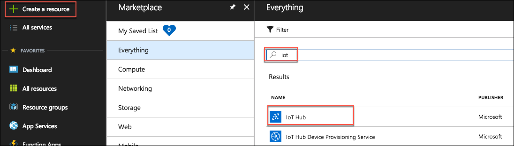

2. On the IoT Hub blade Basics tab, enter the following:

    * **Subscription**: Select the subscription you are using for this hands-on lab

    * **Resource group**: Choose Use existing and select the hands-on-lab-SUFFIX resource group

    * **Region**: Select the location you are using for this hands-on lab

    * **IoT Hub Name**: Enter a unique name, such as smartmeter-hub-SUFFIX

        

    * Select **Next: Size and Scale**.

    * On the Size and scale blade, accept the default Pricing and scale tier of S1: Standard tier, and select **Review + create**.

    * Select **Create** on the Review + create blade.

3. When the IoT Hub deployment is completed, you will receive a notification in the Azure portal. Select **Go to resource** in the notification.

    

4. From the IoT Hub's Overview blade, select **Shared access policies** under Settings on the left-hand menu.

    

5. Select **iothubowner** policy.

    

6. In the **iothubowner** blade, select the Copy button to the right of the **Connection string - primary key** field. You will be pasting the connection string value into a TextBox's Text property value in the next task.

    

### Task 2: Configure the Smart Meter Simulator

If you want to save this connection string with your project (in case you stop debugging or otherwise close the simulator), you can set this as the default text for the text box. Follow these steps to configure the connection string:

1. Return to the `SmartMeterSimulator` solution in Visual Studio on your Lab VM.

2. In the Solution Explorer, double-click `MainForm.cs` to open it. (If the Solution Explorer is not in the upper left corner of your Visual Studio instance, you can find it under the View menu in Visual Studio.)

    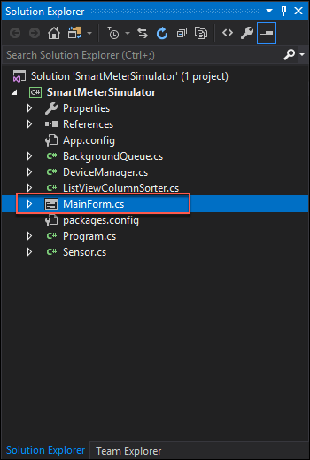

3. In the Windows Forms designer surface, click the **IoT Hub Connection String TextBox** to select it.

    

4. In the Properties panel, scroll until you see the **Text** property. Paste your IoT Hub connection string value copied in step 7 of the previous task into the value for the Text property. (If the properties window is not visible below the Solution Explorer, right-click the TextBox, and select **Properties**.)

    

5. Your connection string should now be present every time you run the Smart Meter Simulator.

    

6. Save `MainForm.cs`.

## Exercise 2: Completing the Smart Meter Simulator

Duration: 60 minutes

Fabrikam has left you a partially completed sample in the form of the Smart Meter Simulator solution. You will need to complete the missing lines of code that deal with device registration management and device telemetry transmission that communicate with your IoT Hub.

### Task 1: Implement device management with the IoT Hub

1. In Visual Studio on your Lab VM, use Solution Explorer to open the file `DeviceManager.cs`.

2. From the Visual Studio **View** menu, click **Task List**.

    

3. In the Task List, you will see a list of `TODO` tasks, where each task represents one line of code that needs to be completed. Complete the line of code below each `TODO` using the code below as a reference.

4. The following code represents the completed tasks in `DeviceManager.cs`:

    ```csharp
    class DeviceManager
    {
        static string connectionString;
        static RegistryManager registryManager;

        public static string HostName { get; set; }

        public static void IotHubConnect(string cnString)
        {
            connectionString = cnString;

            //TODO: 1.Create an instance of RegistryManager from connectionString
            registryManager = RegistryManager.CreateFromConnectionString(connectionString);

            var builder = IotHubConnectionStringBuilder.Create(cnString);

            HostName = builder.HostName;
        }

        /// <summary>
        /// Register a single device with the IoT hub. The device is initially registered in a
        /// disabled state.
        /// </summary>
        /// <param name="connectionString"></param>
        /// <param name="deviceId"></param>
        /// <returns></returns>
        public async static Task<string> RegisterDevicesAsync(string connectionString, string deviceId)
        {
            //Make sure we're connected
            if (registryManager == null)
                IotHubConnect(connectionString);

            //TODO: 2.Create new device
            Device device = new Device(deviceId);

            //TODO: 3.Initialize device with a status of Disabled
            //Enabled in a subsequent step
            device.Status = DeviceStatus.Disabled;

            try
            {
                //TODO: 4.Register the new device
                device = await registryManager.AddDeviceAsync(device);
            }
            catch (Exception ex)
            {
                if (ex is DeviceAlreadyExistsException ||
                    ex.Message.Contains("DeviceAlreadyExists"))
                {
                    //TODO: 5.Device already exists, get the registered device
                    device = await registryManager.GetDeviceAsync(deviceId);

                    //TODO: 6.Ensure the device is disabled until Activated later
                    device.Status = DeviceStatus.Disabled;

                    //TODO: 7.Update IoT Hubs with the device status change
                    await registryManager.UpdateDeviceAsync(device);
                }
                else
                {
                    MessageBox.Show($"An error occurred while registering one or more devices:\r\n{ex.Message}");
                }
            }

            //return the device key
            return device.Authentication.SymmetricKey.PrimaryKey;
        }

        /// <summary>
        /// Activate an already registered device by changing its status to Enabled.
        /// </summary>
        /// <param name="connectionString"></param>
        /// <param name="deviceId"></param>
        /// <param name="deviceKey"></param>
        /// <returns></returns>
        public async static Task<bool> ActivateDeviceAsync(string connectionString, string deviceId, string deviceKey)
        {
            //Server-side management function to enable the provisioned device
            //to connect to IoT Hub after it has been installed locally.
            //If device id device key are valid, Activate (enable) the device.

            //Make sure we're connected
            if (registryManager == null)
                IotHubConnect(connectionString);

            bool success = false;
            Device device;

            try
            {
                //TODO: 8.Fetch the device
                device = await registryManager.GetDeviceAsync(deviceId);

                //TODO: 9.Verify the device keys match
                if (deviceKey == device.Authentication.SymmetricKey.PrimaryKey)
                {
                    //TODO: 10.Enable the device
                    device.Status = DeviceStatus.Enabled;

                    //TODO: 11.Update IoT Hubs
                    await registryManager.UpdateDeviceAsync(device);

                    success = true;
                }
            }
            catch(Exception)
            {
                success = false;
            }

            return success;
        }

        /// <summary>
        /// Deactivate a single device in the IoT Hub registry.
        /// </summary>
        /// <param name="connectionString"></param>
        /// <param name="deviceId"></param>
        /// <returns></returns>
        public async static Task<bool> DeactivateDeviceAsync(string connectionString, string deviceId)
        {
            //Make sure we're connected
            if (registryManager == null)
                IotHubConnect(connectionString);

            bool success = false;
            Device device;

            try
            {
                //TODO: 12.Lookup the device from the registry by deviceId
                device = await registryManager.GetDeviceAsync(deviceId);

                //TODO: 13.Disable the device
                device.Status = DeviceStatus.Disabled;

                //TODO: 14.Update the registry
                await registryManager.UpdateDeviceAsync(device);

                success = true;
            }
            catch (Exception)
            {
                success = false;
            }

            return success;
        }

        /// <summary>
        /// Unregister a single device from the IoT Hub Registry
        /// </summary>
        /// <param name="connectionString"></param>
        /// <param name="deviceId"></param>
        /// <returns></returns>
        public async static Task UnregisterDevicesAsync(string connectionString, string deviceId)
        {
            //Make sure we're connected
            if (registryManager == null)
                IotHubConnect(connectionString);

                //TODO: 15.Remove the device from the Registry
                await registryManager.RemoveDeviceAsync(deviceId);
        }

        /// <summary>
        /// Unregister all the devices managed by the Smart Meter Simulator
        /// </summary>
        /// <param name="connectionString"></param>
        /// <returns></returns>
        public async static Task UnregisterAllDevicesAsync(string connectionString)
        {
            //Make sure we're connected
            if (registryManager == null)
               IotHubConnect(connectionString);

            for(int i = 0; i <= 9; i++)
            {
                string deviceId = "Device" + i.ToString();

                //TODO: 16.Remove the device from the Registry
                await registryManager.RemoveDeviceAsync(deviceId);
            }
        }
    }
    ```
5. Save `DeviceManager.cs`.

### Task 2: Implement the communication of telemetry with the IoT Hub

1. Open `Sensor.cs` from the Solution Explorer, and complete the `TODO` items indicated within the code that are responsible for transmitting telemetry data to the IoT Hub.

2. The following code shows the completed result:

    ```csharp
    class Sensor
    {
        private DeviceClient _DeviceClient;
        private string _IotHubUri { get; set; }
        public string DeviceId { get; set; }
        public string DeviceKey { get; set; }
        public DeviceState State { get; set; }
        public string StatusWindow { get; set; }
        public double CurrentTemperature
        {
            get
            {
                double avgTemperature = 70;
                Random rand = new Random();

                double currentTemperature = avgTemperature + rand.Next(-6, 6);

                if(currentTemperature <= 68)
                    TemperatureIndicator = SensorState.Cold;
                else if(currentTemperature > 68 && currentTemperature < 72)
                    TemperatureIndicator = SensorState.Normal;
                else if(currentTemperature >= 72)
                    TemperatureIndicator = SensorState.Hot;

                return currentTemperature;
            }
        }

        public SensorState TemperatureIndicator { get; set; }

        public Sensor(string iotHubUri, string deviceId, string deviceKey)
        {
            _IotHubUri = iotHubUri;
            DeviceId = deviceId;
            DeviceKey = deviceKey;
            State = DeviceState.Registered;
        }

        public void InstallDevice(string statusWindow)
        {
            StatusWindow = statusWindow;
            State = DeviceState.Installed;
        }

        /// <summary>
        /// Connect a device to the IoT Hub by instantiating a DeviceClient for that Device by Id and Key.
        /// </summary>
        public void ConnectDevice()
        {
            //TODO: 17. Connect the Device to Iot Hub by creating an instance of DeviceClient
            _DeviceClient = DeviceClient.Create(_IotHubUri, new DeviceAuthenticationWithRegistrySymmetricKey(DeviceId, DeviceKey));

            //Set the Device State to Ready
            State = DeviceState.Ready;
        }

        public void DisconnectDevice()
        {
            //Delete the local device client
            _DeviceClient = null;

            //Set the Device State to Activate
            State = DeviceState.Activated;
        }

        /// <summary>
        /// Send a message to the IoT Hub from the Smart Meter device
        /// </summary>
        public async void SendMessageAsync()
        {
            var telemetryDataPoint = new
            {
                id = DeviceId,
                time = DateTime.UtcNow.ToString("o"),
                temp = CurrentTemperature
            };

            //TODO: 18.Serialize the telemetryDataPoint to JSON
            var messageString = JsonConvert.SerializeObject(telemetryDataPoint);

            //TODO: 19.Encode the JSON string to ASCII as bytes and create new Message with the bytes
            var message = new Message(Encoding.ASCII.GetBytes(messageString));

            //TODO: 20.Send the message to the IoT Hub
            var sendEventAsync = _DeviceClient?.SendEventAsync(message);
            if (sendEventAsync != null) await sendEventAsync;
        }
    }
    ```
3. Save `Sensor.cs`.

### Task 3: Verify device registration and telemetry

In this task, you will build and run the Smart Meter Simulator project.

1. In Visual Studio select Build from the Visual Studio menu, then select Build Solution.

2. Run the Smart Meter Simulator, by selecting the green Start button on the Visual Studio toolbar.

    

3. Select **Register** on the Smart Meter Simulator dialog, which should cause the windows within the building to change from black to gray.

    

4. Select a few of the windows. Each represents a device for which you want to simulate device installation. The selected windows should turn yellow.

    

5. Select **Activate** to simulate changing the device status from disabled to enabled in the IoT Hub Registry. The selected windows should turn green.

    

6. At this point, you have registered 10 devices (the gray windows) but activated only the ones you selected (in green). To view this list of devices, you will switch over to the Azure Portal, and open the IoT Hub you provisioned.

7. From the IoT Hub blade, select **IoT Devices** under Explorers on the left-hand menu.

    

8. You should see all 10 devices listed, with the ones that you activated having a status of **enabled**.

    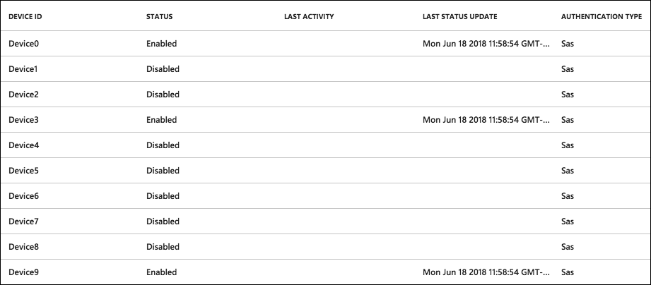

9. Return to the **Smart Meter Simulator** window.

10. Select **Connect**. Within a few moments, you should begin to see activity as the windows change color indicating the smart meters are transmitting telemetry. The grid on the left will list each telemetry message transmitted and the simulated temperature value.

    

11. Allow the smart meter to continue to run. (Whenever you want to stop the transmission of telemetry, select the **Disconnect** button.)

## Exercise 3: Hot path data processing with Stream Analytics

Duration: 45 minutes

Fabrikam would like to visualize the "hot" data showing the average temperature reported by each device over a 5-minute window in Power BI.

### Task 1: Create a Stream Analytics job for hot path processing to Power BI

1. In the [Azure Portal](https://portal.azure.com), select **+ Create a resource**, enter "stream analytics" into the Search the Marketplace box, select **Stream Analytics job** from the results, and select **Create**.

    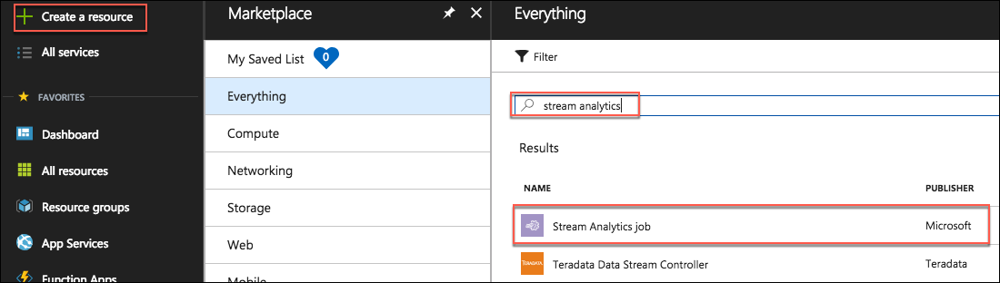

2. On the New Stream Analytics Job blade, enter the following:

    * **Job name**: Enter hot-stream
    * **Subscription**: Select the subscription you are using for this hands-on lab
    * **Resource group**: Choose Use existing and select the hands-on-lab-SUFFIX resource group
    * **Location**: Select the location you are using for resources in this hands-on lab
    * **Hosting environment**: Select Cloud

        

3. Select **Create**.

4. Once provisioned, navigate to your new Stream Analytics job in the portal.

5. On the Stream Analytics job blade, select **Inputs** from the left-hand menu, under Job Topology, then select **+Add stream input**, and select **IoT Hub** from the dropdown menu to add an input connected to your IoT Hub.

    

    

6. On the New Input blade, enter the following:

    * **Input alias**: Enter temps.
    * Choose **Select IoT Hub from your subscriptions**
    * **Subscription**: Select the subscription you are using for this hands-on lab
    * **IoT Hub**: Select the smartmeter-hub-SUFFIX IoT Hub
    * **Endpoint**: Select Messaging
    * **Shared access policy name**: Select service
    * **Consumer Group**: Leave set to $Default
    * **Event serialization format**: Select JSON
    * **Encoding**: Select UTF-8
    * **Event compression type**: Leave set to None

        

7. Select **Save**.

8. Next, select **Outputs** from the left-hand menu, under Job Topology, and select **+ Add**, then select **Power BI** from the drop down menu.

    

9. On the Power BI output blade, enter the following:

    * **Output alias**: Set to powerbi
    * Select **Authorize** to authorize the connection to your Power BI account. When prompted in the popup window, enter the account credentials you used to create your Power BI account in [Before the Hands-on Lab, Task 1](#task-1-provision-power-bi).

        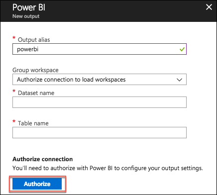

    * For the remaining Power BI settings, enter the following:

        * **Group Workspace**: Select the default, My Workspace
        * **Dataset Name**: Enter avgtemps
        * **Table Name**: Enter avgtemps

10. Select **Save**.

    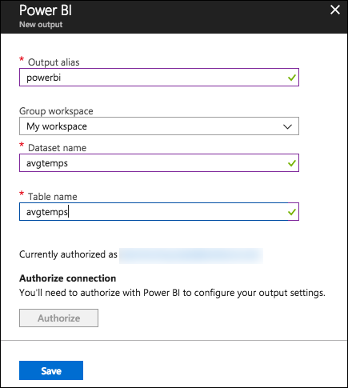

11. Next, select **Query** from the left-hand menu, under Job Topology.

    

12. In the query text box, paste the following query.

    ``` sql
    SELECT AVG(temp) AS Average, id
    INTO powerbi
    FROM temps
    GROUP BY TumblingWindow(minute, 5), id
    ```

13. Select **Save**, and **Yes** when prompted with the confirmation.

    

14. Return to the Overview blade on your Stream Analytics job and select **Start**.

    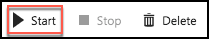

15. In the Start job blade, select **Now** (the job will start processing messages from the current point in time onward).

    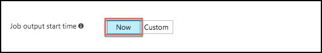

16. Select **Start**.

17. Allow your Stream Analytics Job a few minutes to start.

18. Once the Stream Analytics Job has successfully started, verify that you are showing a non-zero amount of **Input Events** on the **Monitoring** chart on the overview blade. You may need to reconnect your devices on the Smart Meter Simulator and let it run for a while to see the events.

    

### Task 2: Visualize hot data with Power BI

1. Sign in to your Power BI subscription (<https://app.powerbi.com>) to see if data is being collected.

2. Select **My Workspace** on the left-hand menu, then select the **Datasets tab**, and locate the **avgtemps** dataset from the list.

    

3. Select the Create Report button under the Actions column.

    

4. On the Visualizations palette, select **Stacked column chart** to create a chart visualization.

    

5. In the Fields listing, drag the **id** field, and drop it into the **Axis** field.

    

6. Next, drag the **average** field and drop it into the **Value** field.

    

7. Now, set the Value to **Max of average**, by click the down arrow next to **average**, and select **Maximum**.

    

8. Repeat steps 5-8, this time adding a Stacked Column Chart for **Min of average**. (You may need to click on any area of white space on the report designer surface to deselect the Max of average by id chart visualization.)

    

9. Next, add a **table visualization**.

    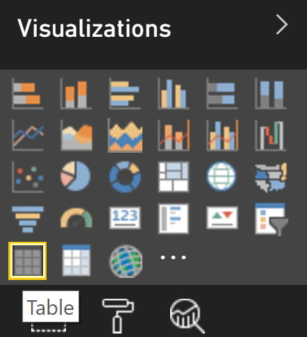

10. Set the values to **id** and **Average of average**, by dragging and dropping both fields in the Values field, then selecting the dropdown next to average, and selecting Average.

    

11. Save the report.

    

12. Enter the name "Average Temperatures," and select **Save**.

    

13. Switch to **Reading View**.

    

14. Within the report, select one of the columns to see the data for just that device.

    

## Exercise 4: Cold path data processing with Azure Databricks

Duration: 60 minutes

Fabrikam would like to be able to capture all the "cold" data into scalable storage so that they can summarize it periodically using a Spark SQL query.

### Task 1: Provision Event Hub

1. In the [Azure portal](https://portal.azure.com), select **+ Create a resource**, enter "event hub" into the Search the Marketplace box, select **Event Hubs** from the results, and select **Create**.

    

2. On the Create Event Hubs Namespace blade, enter the following:

    * **Name**: Enter smartmetereventsSUFFIX
    * **Pricing tier**: Select Basic
    * **Subscription**: Select the subscription you are using for this hands-on lab
    * **Resource group**: Choose Use existing and select the hands-on-lab-SUFFIX resource group
    * **Location**: Select the location you are using for resources in this hands-on lab
    * **Throughput Units**: Leave set to 1

        

3. Select **Create**.

4. Once provisioning completes, navigate to the event hub in the Azure portal.

5. On the Overview blade, select **+ Event Hub**.

    

6. On the Create Event Hub blade, enter **smart-meter-events** for the Name, then select **Create**.

    

### Task 2: Create a messaging endpoint for cold path processing to Power BI

In this task, you will create an endpoint and route for cold data processing.

1. In the [Azure portal](https://portal.azure.com), navigate to your IoT Hub, select **Endpoints** under Messaging in the left-hand menu, and select **+Add**.

    

2. On the Add endpoint blade, enter the following:

    * **Name**: Enter cold-path-endpoint
    * **Endpoint type**: Select Azure Storage Container
    * Select **Azure Storage Container**, select **+ Storage account**, then enter **smartmetersSUFFIX** for the name, and select **OK**.

        

    * Next, select the **smartmetersSUFFIX** account the list of storage accounts, then select **+ Container**, and enter **smartmeters** into the name field, and select **OK**.

        

    * Select the **smartmeters** container and select **Select**.
    * Back on the Add endpoint blade, set the **Blob file name format** to **{iothub}-{partition}/{YYYY}-{MM}-{DD}-{HH}-{mm}**.

        

3. Select **OK**.

4. Now, select **Routes** from the left-hand menu of the IoT Hub blade, then select **+Add**.

    

5. On the Create a new route blade, enter the following:

    * **Name**: enter cold-path-route
    * **Data source**: Select Device Messages
    * **Endpoint**: Select cold-data-endpoint
    * **Query string**: Leave blank (this will match all messages)

        

6. Select **Save**.

### TODO: DELETE: Task 1: Create the Stream Analytics job for cold path processing

To capture all metrics for the cold path, set up another Stream Analytics job that will write all events to Blob storage for analyses by Spark running on HDInsight.

1.  In your browser, navigate to the **Azure Portal** (<https://portal.azure.com>).

2.  Select **+New**, **Data + Analytics**, then select **Stream Analytics job**.
    
    

3.  On the New Stream Analytics Job blade, enter the following:

  * Job Name: Enter **cold-stream**.

  * Subscription: Choose the same subscription you have been using thus far.

  * Resource Group: Choose the **iot-hol** Resource Group.

  * Location: Choose the same Location as you have for your other resources.

  * Hosting environment: Select **Cloud**.

        

  * Select **Create**.

4.  Once provisioned, navigate to your new Stream Analytics job in the portal.

5.  Select **Inputs** on the left-hand menu, under Job Topology.

    

6.  On the Inputs blade, select **+Add**, then **IoT Hub** to add an input connected to your IoT Hub.
    
    

7.  On the New Input blade, enter the following:

  * Input Alias: Set the value to **iothub**.

  * Choose **Select IoT hub from your subscriptions**.

  * IoT Hub: Select your existing IoT Hub, **smartmeter-hub**.

  * Endpoint: Choose **Messaging**.

  * Shared Access Policy Name: Set to **Service**.

  * Consumer Group: Leave as **\$Default**.

  * Event serialization format: Choose **JSON**.

  * Encoding: Choose **UTF-8**.

  * Event compression type: Leave set to **None**.

        

  * Select **Create**.

8.  Now, select **Outputs** from the left-hand menu, under Job Topology.

    

9.  In the Outputs blade, select **+Add**, then **Blob storage** to add the output destination for the query.
    
    

10. On the New output blade, enter the following:

  * Output alias: Set to **blobs**.

  * Choose **Select blob storage from your subscriptions**.

  * Storage account: Choose the storage account name you used for HDInsight in Before the hands-on lab, Task 2, Step 5c.

  * Container: Set to **iotcontainer**.

  * Path pattern: Enter **smartmeters/{date}/{time}**.

  * Date format: Select **YYYY/MM/DD**.

  * Time format: Select **HH**.

  * Event serialization formation: Select **CSV**.

  * Delimiter: Select **comma (,)**.

  * Encoding: Select **UTF-8**.

        

  * Select **Save**.

11. Next, select **Query** from the left-hand menu, under Job Topology.
    
    

12. In the query text box, paste the following query.
    ```
    SELECT
          *
    INTO 
          blobs
    FROM 
          iothub
    ```

13. Select **Save,** and **Yes** when prompted with the confirmation.

    

14. Return to the Overview blade on your Stream Analytics job, and select **Start**.

    

15. In the Start job blade, select **Now** (the job will start processing messages from the current point in time onward).
    
    

16. Select **Start**.

17. Allow your Stream Analytics Job a few minutes to start.

18. Once the Stream Analytics Job has successfully started, verify that you are showing a non-zero amount of **Input Events** on the **Monitoring** chart on the overview blade. You may need to reconnect your devices on the Smart Meter Simulator and let it run for a while to see the events.

    

### Task 3: Verify CSV files in blob storage

In this task, we are going to verify that the CSV file is being written to blob storage. (Note, this can be done via Visual Studio, or using the Azure portal. For this lab, we will perform the task using Visual Studio.)

1. Within Visual Studio on your Lab VM, select the **View** menu, then select **Cloud Explorer**.

    

2. In **Cloud Explorer**, select Account Management, and connect to your Microsoft Azure Subscription.

    

3. If prompted, sign into your Azure account.

4. Allow Cloud Explorer about 30 seconds to load your subscription resources.

5. Expand your Azure account, then expand **Storage Accounts**, expand the smartmetersSUFFIX storage account, then right-click the smartmeters container, and select **Open**. It may take a few moments to load your storage accounts.

    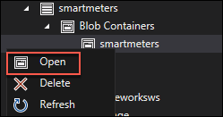

6. Verify files are being written to Blob storage and take note of the path to one of the files (the files should be located underneath the smartmeters container).

    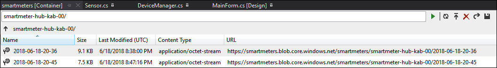

### Task 3: Update pandas version on the Spark cluster

In this task you will connect SSH into your HDInsight cluster, and update the version of pandas that Jupyter Notebook uses. This task is to address errors that are displayed because the autovizwidget in Jupyter needs a later version of pandas that has the API module.

1.  In the Azure portal, navigate to the blade for your Spark Cluster, under your HDInsight Cluster.

2.  On the cluster's overview blade, select **Secure Shell (SSH)** from the toolbar.
    
    

3.  On the SSH + Cluster login blade, select your cluster from the Hostname drop down, then select the **copy button** next to the text box.
    
    

4.  On your Lab VM, select your open Git Bash client (or open a new one if you closed it).

1.  At the command prompt, paste the SSH connection string you copied in step 3, above. When prompted about continuing, type "yes."
    
    

6.  Enter your password, Password.1!!, when prompted, and press **Enter**.
    
    

7.  Once logged in, you will be presented with a command prompt, similar to the following:
    
    

8.  At the command prompt, enter the following command to install the latest version of pandas, which has the API module required by the autovizwidget.
    ```
    sudo -HE /usr/bin/anaconda/bin/conda install pandas
    ```
9.  When prompted to Proceed, type "y."
    
    ![In the Git Bash Window, the following line is highlighted: Proceed (\[y\]n)? y](./media/image90.png "Git Bash Window")

### Task 4: Process with Spark SQL 

1.  Navigate to the blade for your Spark Cluster in the Azure Portal, under you HDInsight Cluster.

2.  Under Quick Links, click **Cluster Dashboard**.
    
    

3.  On the Cluster Dashboards blade, select **Jupyter Notebook**. If prompted, log in with admin credentials you provided when creating the cluster (username: **admin**, password: **Password.1!!**).
    
    

4.  From the navigation bar in the Jupyter site, select **New** and then **Spark.**
    
    

5.  In the first text area (referred to as a paragraph in notebook jargon), enter the following **Scala code** that will load, parse, and save your batch scored telemetry data as a table that you can later query using Spark SQL. Before executing, make sure to replace the highlighted text with the correct path to your telemetry file, noted previously in the Cloud Explorer in Visual Studio.
    ```
    import spark.implicits._

    val rawText = spark.read.text("wasb:///smartmeters/2017/08/20/19/1008078303_90a84f7aba614d1fa4688cbda1de3846_1.csv")
    case class SmartMeterMetrics(id:String,time:String,temp:Integer)
    val telemetryRDD = rawText.map(row => row.getString(0).split(",")).filter(s=>s(0) != "id").map(
        s => SmartMeterMetrics(s(0), s(1), s(2).toInt)
    )
    val telemetryDF = telemetryRDD.toDF()
    telemetryDF.write.saveAsTable("SmartMeters")
    ```

1.  Next, click the **Run** icon in the toolbar to execute this code and create the **SmartMeters** table
    
    . 

7.  The block is finished running when the In\[\*\] changes to In\[1\]\
    
    

    You may see the below message. You can proceed.
    
    

8.  In the second cell, enter the following SQL query and run it.
    ```
    %%sql
    select id, count(*) as count, avg(temp) averageTemp from SmartMeters group by id order by id
    ```

    You will see a table like the following:

    

9.  Next, create a table that will summarize the telemetry collected using the previous query. In a new paragraph, try running the following query:
    ```
    //query the table to create a summary result set
    val summary = spark.sql("select id, count(*) as count, avg(temp) averageTemp from SmartMeters group by id order by id")

    //save the new pre-computed view
    summary.write.saveAsTable("DeviceSummary")
    ```

10. Next, query from this summary table by executing the following query.
    ```
    %%sql
    select * from DeviceSummary
    ```

11. In the results, click the **Bar** button.

12. In the X dropdown, select **id**.

13. In the Y dropdown, select **averageTemp**.

14. In the Func dropdown, select **Avg**.

15. Check the box for **Log scale** **Y.**

16. Observe the results graphed as a column chart, where each column represents a device's average temperature.
    
    

## Exercise 6: Reporting device outages with IoT Hub Operations Monitoring

Duration: 20 minutes

Fabrikam would like to be alerted when devices disconnect and fail to reconnect after a period. Since they are already using PowerBI to visualize hot data, they would like to see a list of any of these devices in a report.

### Task 1: Enable verbose connection monitoring on the IoT Hub

To keep track of device connects and disconnects, we first need to enable verbose connection monitoring.

1.  In your browser, navigate to the **Azure Portal** (<https://portal.azure.com)>.

2.  Open the IoT Hub you provisioned earlier, **smart-meter**.

3.  Under SETTINGS in the left-hand menu, click on **Operations monitoring**.
    
    

4.  Select **Verbose** for **Log events when a device connects or disconnects from the IoT Hub**.

    

5.  Click **Save**.

### Task 2: Collect device connection telemetry with the hot path Stream Analytics job

Now that the device connections are being logged, update your hot path Stream Analytics job (the first one you created) with a new input that ingests device telemetry from Operations Monitoring. Next, create a query that joins all connected and disconnected events with a DATEDIFF function that only returns devices with a disconnect event, but no reconnect event within 120 seconds. Output the events to Power BI.

1.  In your browser, navigate to the **Azure Portal** (<https://portal.azure.com)>.

2.  Open the **hot-stream** Stream Analytics job (the first one you created).

3.  Stop the job if it is currently running, from the Overview blade, by selecting **Stop**, then **Yes** when prompted.
    
    

4.  Select **Inputs** on the left-hand menu, under Job Topology.

    

5.  On the Inputs blade, select **+Add**, then **IoT Hub** to add an input connected to your IoT Hub.
    
    

6.  On the New Input blade, enter the following:

  * Input Alias: Set the value to **connections**.

  * Import Option: Choose **Select IoT hub from your subscriptions**.

  * IoT Hub: Select your existing IoT Hub, **smartmeter-hub**.

  * Endpoint: Choose **Operations monitoring**.

  * Shared Access Policy Name: Set to **Service**.

  * Consumer Group: Leave as **\$Default**.

  * Event serialization format: Choose **JSON**.

  * Encoding: Choose **UTF-8**.

  * Event compression type: Leave set to **None**.

        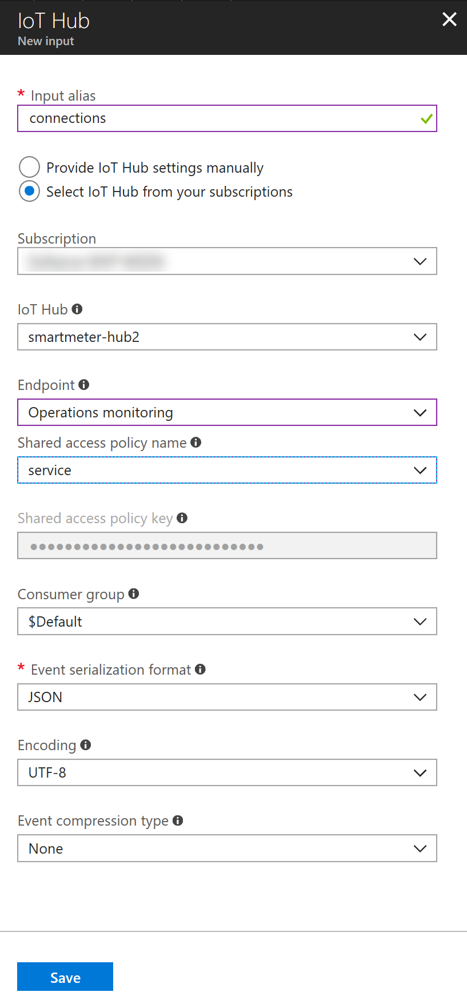

  * Select **Save**.

7. Now, select **Outputs** from the left-hand menu, under Job Topology.

    

8. In the Outputs blade, select **+Add**, the **Power BI**, to add the output destination for the query.
    
    

9. On the New output blade, enter the following:

  * Set the **Output alias** to **powerbi-outage**.

        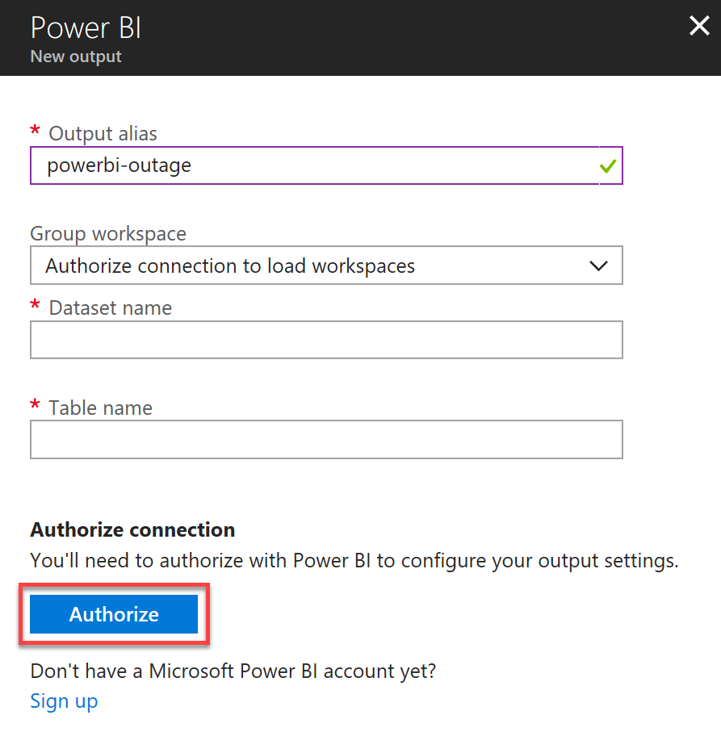

  * Select **Authorize** under Authorize Connection.

    Follow the on-screen prompts to log on to your Power BI account.

    After authenticating, complete the remaining fields as follows:

  * Group Workspace: Leave set to **My Workspace**.

  * Dataset Name: Enter **deviceoutage**

  * Table Name: Enter **deviceoutage**

  * Select **Save**.

        

10. Next, select **Query** from the left-hand menu, under Job Topology.
    
    

11. We will replace the hot path query, which selects the averages of the temperatures into the PowerBI output, with queries that perform the following:

  * Select **device disconnection events**.

  * Select **device connection events**.

  * Join these two streams together using the Stream Analytics DATEDIFF operation on the LEFT JOIN, and then filter out any records where there was a match. This gives us devices that had a disconnect event, but no corresponding connect event within 120 seconds. Output to the Service Bus.

  * Execute the original hot path query.

12. Replace the existing query with the following, and click **Save** in the **command bar** at the top. (Be sure to substitute in your output aliases and input aliases):
    ```
    WITH
    Disconnected AS (
    SELECT *
    FROM connections TIMESTAMP BY [Time]
    WHERE OperationName = 'deviceDisconnect'
        AND Category = 'Connections'
    ),
    Connected AS (
    SELECT *
    FROM connections TIMESTAMP BY [Time]
    WHERE OperationName = 'deviceConnect'
        AND Category = 'Connections'
    )

    SELECT Disconnected.DeviceId, Disconnected.Time
    INTO [powerbi-outage] 
    FROM Disconnected
    LEFT JOIN Connected 
        ON DATEDIFF(second, Disconnected, Connected) BETWEEN 0 AND 120
        AND Connected.deviceId = Disconnected.deviceId
    WHERE Connected.DeviceId IS NULL;

    SELECT AVG(temp) AS Average, id
    INTO powerbi
    FROM temps
    GROUP BY TumblingWindow(minute, 5), id;
    ```

13. Select **Save,** and **Yes** when prompted with the confirmation.

    

14. Return to the Overview blade on your Stream Analytics job, and select **Start**.

    

15. In the Start job blade, select **Now** (the job will start processing messages from the current point in time onward).
    
    

16. Select **Start**.

17. Allow your Stream Analytics Job a few minutes to start.

### Task 3: Test the device outage notifications

Register and activate a few devices on the Smart Meter Simulator, then connect them. Deactivate them without reconnecting in order for them to show up in the device outage report we will create in the next task.

1.  Run the Smart Meter Simulator from Visual Studio.

2.  Click the **Register** button.
    
    

3.  Click on 3 of the windows to highlight them.
    
    

4.  Click the **Activate** button.
    
    

5.  Click the **Connect** button.
    
    

6.  After a few seconds, click **Disconnect**.
    
    

7.  Click **Unregister**.
    
    

### Task 4: Visualize disconnected devices with Power BI

1.  Log on to **Power BI** to see if data is being collected.

2.  As done previously, select My Workspace on the left-hand menu, then select the Datasets tab. A new dataset should appear, named **deviceoutage**. (It is starred to indicate it is new) If you do not see the dataset, you may need to connect your devices on the Smart Meter Simulator, then disconnect and unregister them and wait up to 5 minutes.
    
    

3.  Select the **Create report** icon under actions for the dataset.
    
    

4.  Add a **Table visualization**.

    

5.  Select the **deviceid** and **time** fields, which will automatically be added to the table. You should see the Device Id of each of the devices you connected, and then disconnected for more than 2 minutes.
    
    \
    
    

6.  Save the report as **Disconnected Devices**.

    

7.  Switch to **Reading View**.

    

8.  Within the report, click the column headers to sort by device or date. You may run a few more tests with the Smart Meter Simulator and periodically refresh the report to see new devices.

    

## After the hands-on lab 

Duration: 10 minutes

In this exercise, attendees will deprovision any Azure resources that were created in support of the lab.

### Task 1: Delete the resource group

1.  Using the Azure portal, navigate to the Resource group you used throughout this hands-on lab by selecting **Resource groups** in the left menu.

2.  Search for the name of your research group, and select it from the list.

3.  Select **Delete** in the command bar, and confirm the deletion by re-typing the Resource group name, and selecting **Delete**.

