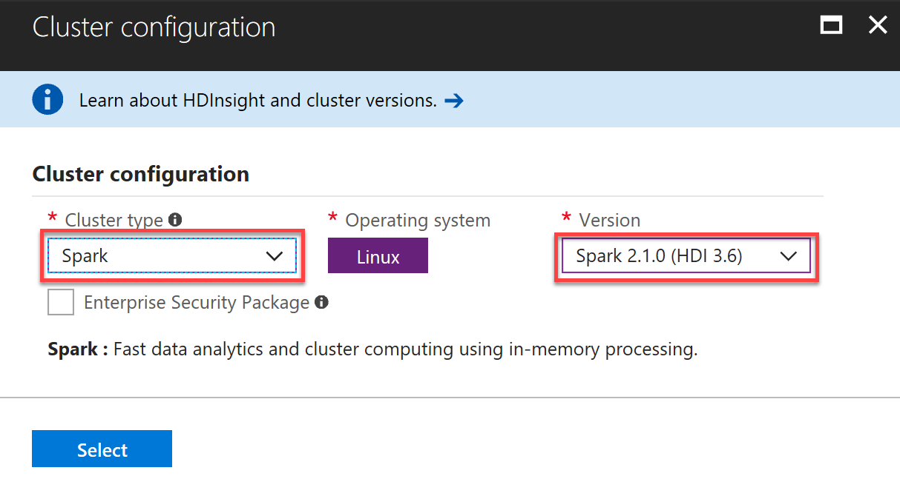
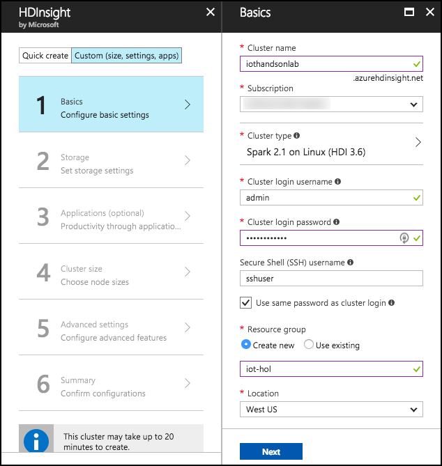
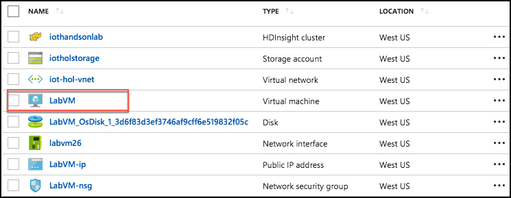

# Internet of Things setup

## Requirements

-   Microsoft Azure subscription must be pay-as-you-go or MSDN.

    -   Trial subscriptions will not work.

-   A virtual machine configured with:

    -   Visual Studio Community 2017 15.6 or later

    -   Azure SDK 2.9 or later (Included with Visual Studio 2017)

    -   [R Tools for Visual Studio](https://aka.ms/rtvs-current) 0.3.2 or later

    -   [Power BI Desktop](https://powerbi.microsoft.com/desktop) (June 2016 build or later)

-   A running R Server on HD Insight Spark cluster 

## Before the hands-on lab

Duration: 45 minutes

In this exercise, you will set up your environment for use in the rest of the hands-on lab. You should follow all the steps provided in the Before the hands-on lab section to prepare your environment *before* attending the hands-on lab.

### Task 1: Provision Power BI

If you do not already have a Power BI account:

1.  Go to <https://powerbi.microsoft.com/features/>.

2.  Scroll down until you see the **Try Power BI for free!** section of the page and click the **Try Free\>** button.
    
    

3.  On the page, enter your work email address (which should be the same account as the one you use for your Azure subscription), and select **Sign up**.
    
    

4.  Follow the on-screen prompts, and your Power BI environment should be ready within minutes. You can always return to it via <https://app.powerbi.com/>.

### Task 2: Provision an HDInsight with Spark Cluster

Using the Azure Portal, provision a new HDInsight cluster.

1.  Open a browser, and go to the Azure portal (<https://portal.azure.com>).

2.  Select **+New**, select **Data + Analytics**, then select **HDInsight**.
    
    

3.  On the HDInsight blade, select **Custom (size, settings, apps)**.
    
    

4.  On the Basics blade, enter the following settings:

    -   Cluster name: Enter a unique name (verified by the green checkmark).

    -   Subscription: Select the Azure subscription into which you want to deploy the cluster.

    -   Custer type: Select ***Configure required settings***.

        

        i.  On the Cluster configuration blade, set the **Cluster type** to **Spark** and the **Version** to **Spark 2.1.0 (HDI 3.6)**. Note that the Operating System option for the Spark cluster is fixed to Linux.
            
        

        ii. Select **Select** to close the Cluster configuration blade.

    -   Cluster login username: Leave as **admin**.

    -   Cluster login password: Enter **Password.1!!** for the admin password.

    -   Secure Shell (SSH) username: Enter **sshuser**.

    -   Use same password as cluster login: Ensure the checkbox is **checked**.

    -   Resource group: Select the Create new radio button, and enter **iot-hol** for the resource group name.

    -   Location: Select the desired location from the dropdown list, and remember this, as the same location will be used for all other Azure resources.
        
        

    -   Select **Next** to move on to the storage settings.

5.  On the Storage blade:

    -   Primary storage type: Leave set to **Azure Storage.**

    -   Selection Method: Leave set to **My subscriptions**.

    -   Select a Storage account: Select Create new, and enter a name for the storage account, such as iotholstorage.

    -   Default container: Enter **iotcontainer**.

    -   Additional storage accounts: Leave unconfigured.

    -   Data Lake Store access: Leave unconfigured.

    -   Metastore Settings: Leave blank. 

        

    -   Select **Next**.

6.  Select **Next** on the Applications (optional) blade. No applications are being added.

7.  On the Cluster size blade:

    -   Number of worker nodes: Leave set to **4**.

    -   Select **Worker node size**, and select **D12 v2**, then select **Select**.
        
        

    -   Leave **Head node size**, set to the default, **D12 v2**.
        
        

    -   Select **Next**.

8. Select **Next** on the Advanced settings blade to move to the Cluster summary blade.

9. Select **Create** on the Cluster summary blade to create the cluster.

10. It will take approximately 20 minutes to create your cluster. You can move on to the steps below while the cluster is provisioning.

### Task 3: Setup a lab virtual machine (VM)

1.  In the [Azure Portal](https://portal.azure.com/), select **+New**, then type "Visual Studio" into the search bar. Select **Visual Studio Community 2017 (latest release) on Windows Server 2016 (x64)** from the results**.
    
    

2.  On the blade that comes up, at the bottom, ensure the deployment model is set to **Resource Manager** and select **Create**.

    

3.  Set the following configuration on the Basics tab.

-   Name: Enter **LabVM**.

-   VM disk type: Select **SSD**.

-   User name: Enter **demouser**

-   Password: Enter **Password.1!!**

-   Subscription: Select the same subscription you used to create your cluster in [Task 1](#task-1-provision-power-bi).

-   Resource Group: Select Use existing, and select the resource group you provisioned while creating your cluster in Task 1.

-   Location: Select the same region you used in Task 1 while creating your cluster.
    
    

4.  Select **OK** to move to the next step.

5.  On the Choose a size blade, ensure the Supported disk type is set to SSD, and select View all. This machine won't be doing much heavy lifting, so selecting **DS2\_V3** **Standard** is a good baseline option.
    
    

6.  Select **Select** to move on to the Settings blade.

7.  Accept all the default values on the Settings blade, and Select **OK**.

8.  Select **Create** on the Create blade to provision the virtual machine.
    
    

9.  It may take 10+ minutes for the virtual machine to complete provisioning.

### Task 4: Connect to the lab VM

1.  Connect to the Lab VM. (If you are already connected to your Lab VM, skip to Step 9.)

2.  From the left side menu in the Azure portal, click on **Resource groups**, then enter your resource group name into the filter box, and select it from the list.
    \
    

3.  Next, select your lab virtual machine, **LabVM**, from the list.
    
    

4.  On your Lab VM blade, select **Connect** from the top menu.
    
    

5.  Download and open the RDP file.

6.  Select Connect on the Remote Desktop Connection dialog.
    
    

7.  Enter the following credentials (or the non-default credentials if you changed them):

    -   User name: **demouser**

    -   Password: **Password.1!!

        

8.  Select **Yes** to connect, if prompted that the identity of the remote computer cannot be verified.
    
    

9.  Once logged in, launch the Server Manager. This should start automatically, but you can access it via the Start menu if it does not start.

10. Select Local Server, then select On next to IE Enhanced Security Configuration.
    
    

11. In the Internet Explorer Enhanced Security Configuration dialog, select **Off** under Administrators, then select **OK**.
    
    

12. Close the Server Manager.

### Task 5: Prepare an SSH client

In this task, you will download, install, and prepare the Git Bash SSH client that you will use to access your HDInsight cluster from your Lab VM.

1.  On your Lab VM, open a browser, and navigate to <https://git-scm.com/downloads> to download Git Bash.
    
    

2.  Select the download for your OS, and then select the Download 2.15.x for... button.

3.  Run the downloaded installer, select Next on each screen to accept the defaults.

4.  On the last screen, select Install to complete the installation.
    
    

1. When the install is complete, you will be presented with the following screen:
    
    

6. Check **the Launch Git Bash** checkbox, and uncheck View Release Notes. Select **Finish**.

7. Leave the bash window open, as you will use it later in this lab.
